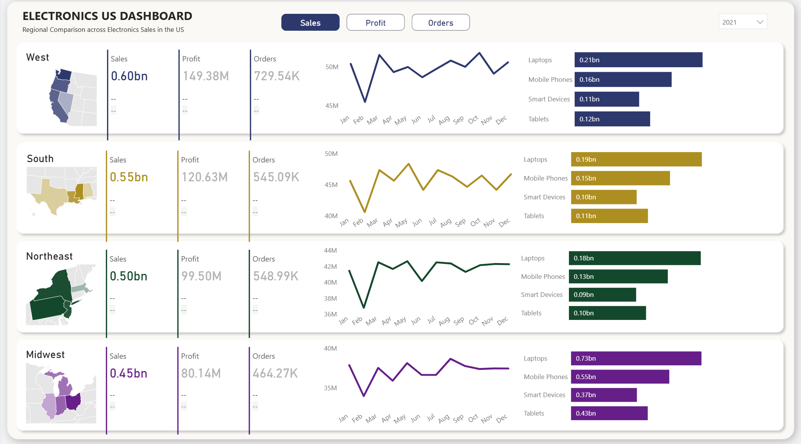
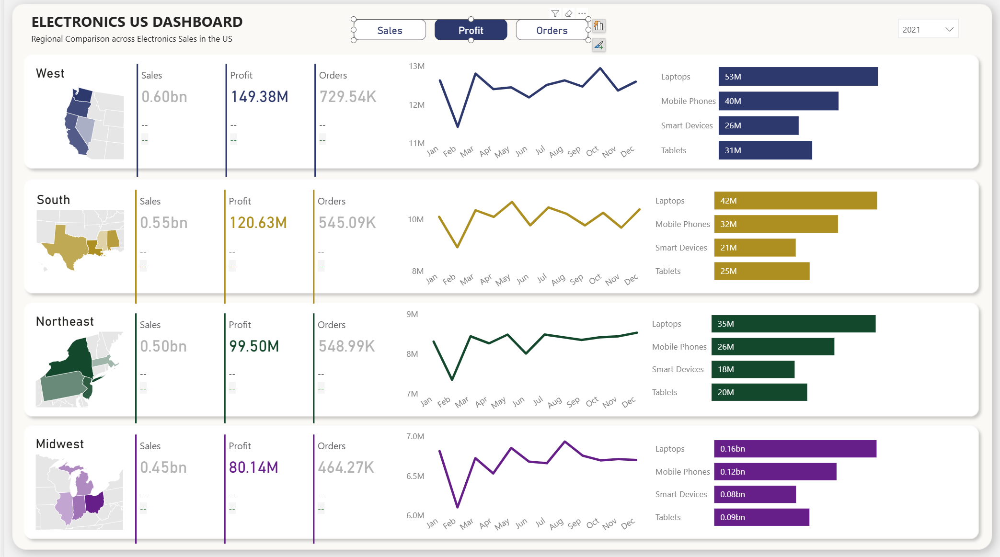
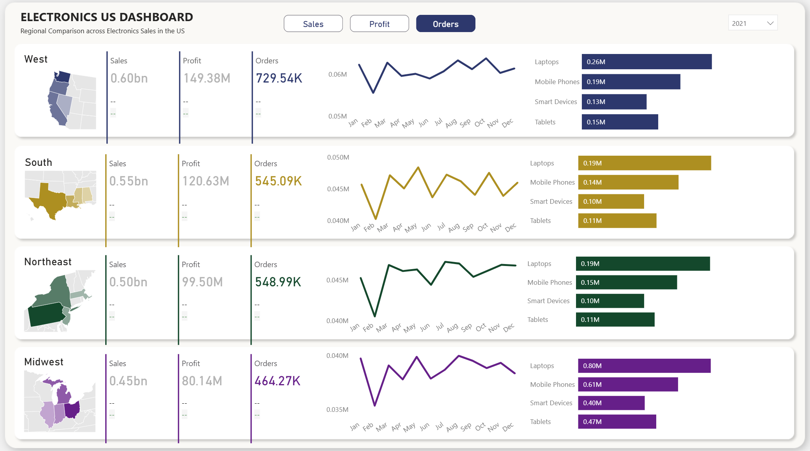
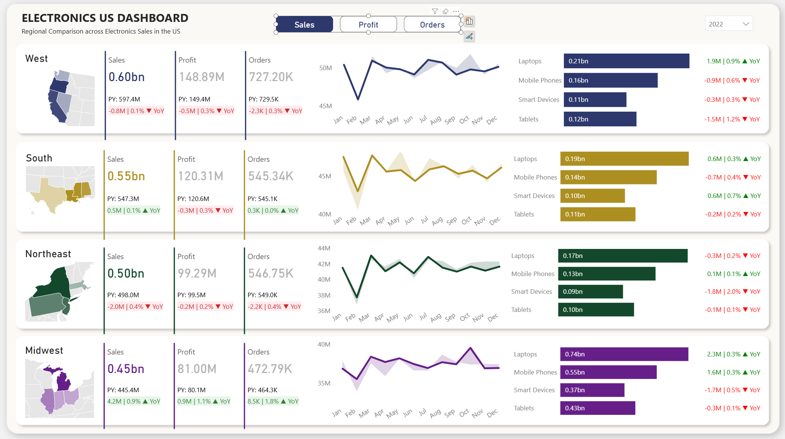
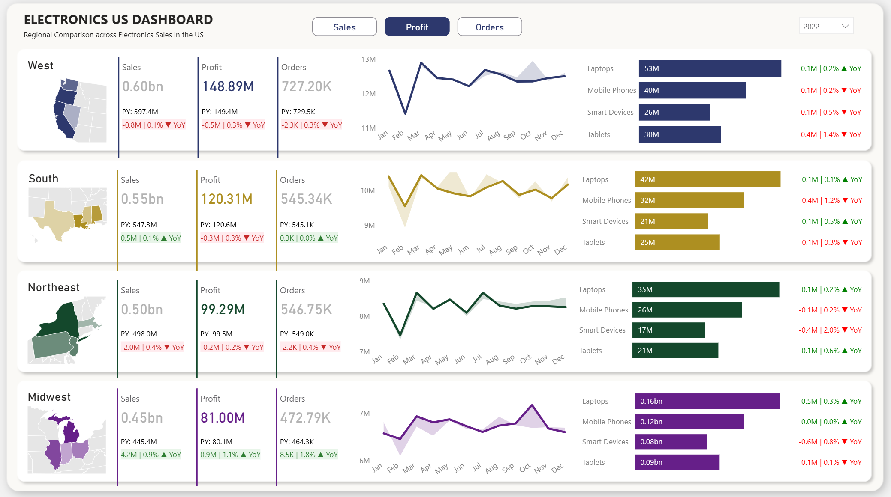
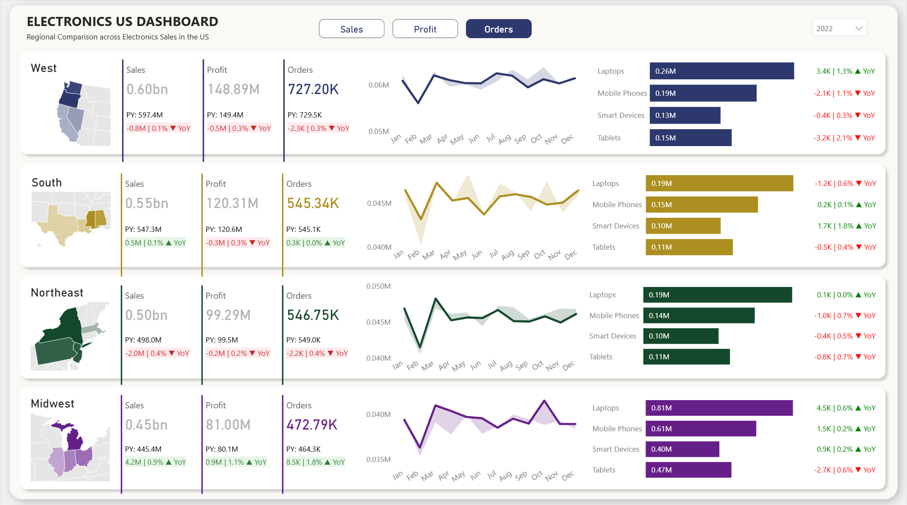
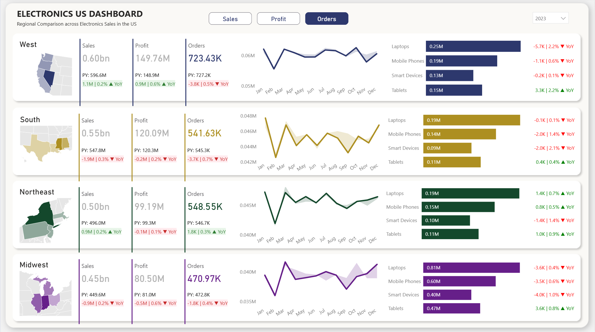
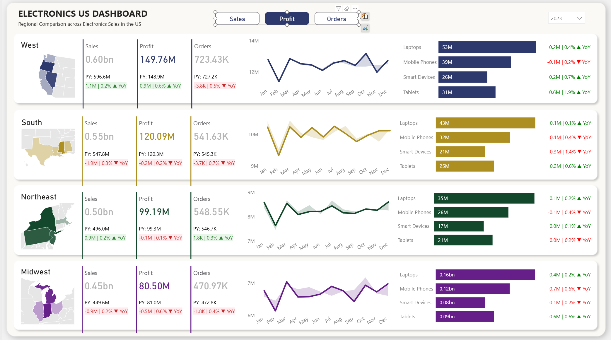
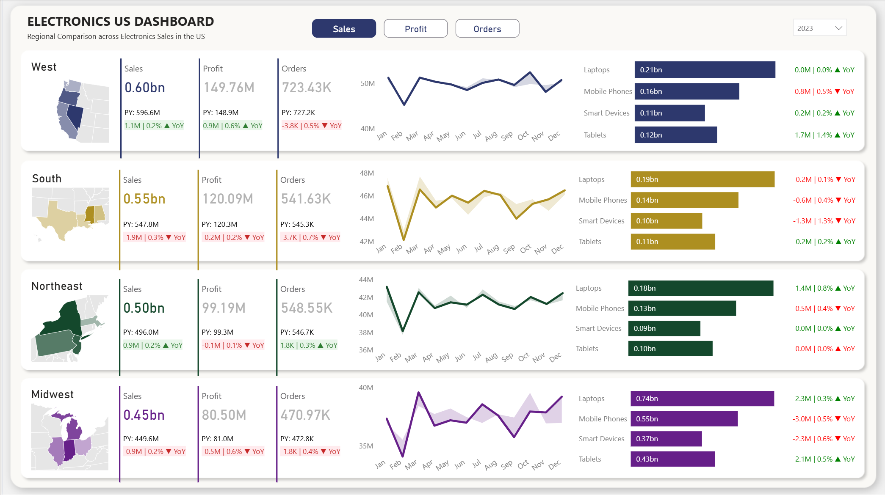

# TechVista Electronics - Regional Sales Performance Dashboard

   

> Analyzing $2B+ in electronics sales across 4 US regions to uncover performance disparities and drive strategic growth through interactive dashboards and advanced DAX analytics.

[View Live Dashboard](https://app.powerbi.com/view?r=eyJrIjoiMTEwNDYxMDAtOTBiMi00ZGFmLTg4MWQtNTljY2Y5YjAzOTlkIiwidCI6ImJlODMyOWE3LTcyMTgtNDlhMy05YWMxLWQ3Yjk1NDU2M2YzOSIsImMiOjEwfQ%3D%3D) | [Documentation](./Documentation_csv_with_descriptions.csv)

---

## Table of Contents

- [Client Background](#client-background)
- [Executive Summary](#executive-summary)
  - [Questions Answered](#questions-answered)
  - [Findings at a Glance](#findings-at-a-glance)
  - [Business Impact](#business-impact)
- [Dashboard Analysis](#dashboard-analysis)
  - [Figure 1: 2021 Sales Overview](#figure-1-2021-sales-overview)
  - [Figure 2: 2021 Profit Performance](#figure-2-2021-profit-performance)
  - [Figure 3: 2021 Orders Distribution](#figure-3-2021-orders-distribution)
  - [Figure 4: 2022 Sales with YoY Comparison](#figure-4-2022-sales-with-yoy-comparison)
  - [Figure 5: 2022 Profit with YoY Comparison](#figure-5-2022-profit-with-yoy-comparison)
  - [Figure 6: 2022 Orders with YoY Comparison](#figure-6-2022-orders-with-yoy-comparison)
  - [Figure 7: 2023 Orders Trends](#figure-7-2023-orders-trends)
  - [Figure 8: 2023 Profit Analysis](#figure-8-2023-profit-analysis)
  - [Figure 9: 2023 Sales Performance](#figure-9-2023-sales-performance)
- [Key Findings](#key-findings)
- [Methodology](#methodology)
- [Skills & Technologies](#skills--technologies)
- [Next Steps](#next-steps)
- [Lessons Learned](#lessons-learned)

---

## Client Background

**TechVista Electronics** is a mid-sized electronics retailer operating across the United States with a focus on four key product categories: Laptops, Mobile Phones, Smart Devices, and Tablets. Founded in 2018, TechVista has established a strong presence in four major regions: West, South, Northeast, and Midwest.

The company operates through a network of retail stores and online channels, serving both consumer and small business markets. With annual revenues exceeding $2 billion, TechVista has positioned itself as a reliable supplier of quality electronics with competitive pricing.

**Business Challenge**: TechVista's executive leadership noticed stagnating growth patterns and significant regional performance disparities. The company needed a comprehensive analytics solution to:
- Understand regional performance differences
- Identify underperforming product categories
- Track year-over-year trends
- Make data-driven decisions for strategic expansion

**Project Objective**: Develop an interactive Power BI dashboard that provides real-time insights into sales, profit, and orders across all regions and product categories, with dynamic year-over-year comparison capabilities.

---

## Executive Summary

### Questions Answered

1. **Which region generates the highest profitability?**
   - West region leads with 25.1% profit margin

2. **How has the business performed year-over-year?**
   - Minimal growth observed (±0.09% variance) indicating market stagnation

3. **Which product categories drive the most revenue?**
   - Laptops dominate at 35.3% of total sales

4. **Are there seasonal patterns in sales performance?**
   - Minimal seasonality with February being the weakest month

5. **Which states offer the best market opportunities?**
   - Nevada, Oregon, California, and Washington show strongest margins (25%+)

### Findings at a Glance

| Metric | 2021 | 2022 | 2023 | Trend |
|--------|------|------|------|-------|
| **Total Sales** | $2.09B | $2.09B | $2.09B | 📊 Flat |
| **Total Profit** | $450M | $449M | $450M | 📊 Flat |
| **Profit Margin** | 21.53% | 21.51% | 21.52% | 📊 Stable |
| **Best Region** | West | West | West | ⬆️ Consistent Leader |
| **Top Product** | Laptops | Laptops | Laptops | ⬆️ Dominant |

### Business Impact

- **$7.1 percentage point** margin gap between West (25.1%) and Midwest (17.9%) represents **$40M+ in potential profit improvement**
- **Zero growth** over three years signals need for immediate strategic intervention
- **West region's success** can be replicated in other regions to drive $35-50M in additional annual profit
- **Product margin uniformity** (~21.5%) suggests pricing commoditization and need for differentiation

---

## Dashboard Analysis

### Figure 1: 2021 Sales Overview

**Analysis**: This baseline view establishes the 2021 performance across all four regions. The West region generated **$0.60B in sales** with Laptops leading at $0.21B. The visualization shows a relatively stable monthly trend with a notable dip in February (down to ~45M) and recovery through the year. Product distribution remains consistent across regions, with Laptops contributing approximately 35% in each market.

**Key Observations**:
- West and South regions show comparable sales volumes
- Monthly fluctuations range within 10M bandwidth
- Laptops consistently outperform other categories by 30-40%

---

### Figure 2: 2021 Profit Performance

**Analysis**: The profit view reveals significant **regional margin disparities** with West achieving **$149.38M (25% margin)** compared to Midwest's **$80.14M (17.9% margin)**. This visualization highlights that while sales volumes may be similar, operational efficiency varies dramatically. The line chart shows profit trends mirroring sales patterns, indicating consistent margin maintenance throughout the year.

**Key Observations**:
- 7+ percentage point margin gap between best and worst regions
- Mobile Phones generate second-highest profit contribution (~26-27%)
- Regional color coding (Blue/Gold/Green/Purple) aids quick identification

---

### Figure 3: 2021 Orders Distribution

**Analysis**: Orders metrics show **West leading with 729.54K orders** while Midwest trails at 464.27K. The per-product breakdown reveals Laptops attracting **0.26M orders** in West despite higher price points, indicating strong market demand. The temporal view shows order volume fluctuations that align with sales patterns, suggesting consistent average order values.

**Key Observations**:
- Order volume correlates directly with sales volume
- West processes 57% more orders than Midwest
- Tablet orders remain lowest across all regions

---

### Figure 4: 2022 Sales with YoY Comparison

**Analysis**: The 2022 dashboard introduces **YoY comparison metrics** showing mixed performance. West experienced a **slight decline (-0.8M | 0.1% YoY)** despite maintaining market leadership. The South region showed modest growth (+0.5M | 0.1% YoY), while Northeast declined (-2.0M | 0.4% YoY). Product-level metrics reveal Laptops growing in West (+1.9M | 0.9% YoY) while Mobile Phones declined across most regions.

**Key Observations**:
- Flat overall growth masks regional variations
- Previous Year (PY) comparisons enable performance tracking
- Red/Green indicators provide instant performance recognition

---

### Figure 5: 2022 Profit with YoY Comparison

**Analysis**: Profit analysis reveals concerning trends with **West margins declining (-0.5M | 0.3% YoY)** despite sales stability. Midwest showed improvement (+4.2M | 0.9% YoY), suggesting operational efficiency gains. The visualization demonstrates that **profit growth doesn't always align with sales growth**, highlighting the importance of margin management. Regional performance indicators show mixed results with no clear winner.

**Key Observations**:
- Margin compression evident in top-performing regions
- Midwest operational improvements yield profit gains
- Laptop profit declined across most regions

---

### Figure 6: 2022 Orders with YoY Comparison

**Analysis**: Orders data shows slight increases in most regions with **Midwest leading growth (+8.5K | 1.8% YoY)**. West region's order growth (+3.4K | 1.3% YoY) exceeded sales growth, suggesting decreasing average order values or increased promotional activity. The product breakdown reveals Tablets gaining order share (+3.3K | 2.2% YoY in West) while maintaining stable revenues.

**Key Observations**:
- Order volume growth exceeds revenue growth (margin pressure)
- Midwest showing strongest order momentum
- Smart Devices orders declining in multiple regions

---

### Figure 7: 2023 Orders Trends

**Analysis**: 2023 orders show **continued flat performance** with West at 723.43K (-3.8K | 0.5% YoY decline). However, product-level analysis reveals interesting shifts: West Tablets surged (+3.3K | 2.2% YoY) while Mobile Phones declined (-1.1K | 0.6% YoY). The temporal trend shows stable monthly patterns with slight variations, suggesting mature market conditions without significant growth catalysts.

**Key Observations**:
- Third consecutive year of minimal growth
- Tablet orders showing resilience
- Northeast Smart Devices declining consistently

---

### Figure 8: 2023 Profit Analysis

**Analysis**: Profit performance in 2023 demonstrates **marginal improvements** with West growing (+0.9M | 0.6% YoY) after 2022's decline. Midwest continues its positive trajectory (+0.5M | 0.3% YoY), indicating sustained operational improvements. The visualization shows **Laptops maintaining profitability** (+0.2M | 0.4% YoY in West) while Mobile Phones face margin pressure across regions. Monthly profit trends remain stable without dramatic fluctuations.

**Key Observations**:
- Margin stabilization in key regions
- Midwest consistency suggests replicable best practices
- Product margins converging toward 21.5% baseline

---

### Figure 9: 2023 Sales Performance

**Analysis**: The final dashboard shows 2023 sales at **$0.60B for West** (+1.1M | 0.2% YoY), essentially unchanged from 2021. This three-year view confirms **growth stagnation** across all regions and products. The product mix remains remarkably stable with Laptops at 35%, Mobile Phones at 26%, Smart Devices at 18%, and Tablets at 21% across all regions. Monthly trends show predictable patterns with February consistently weak and October-December showing slight strengthening.

**Key Observations**:
- Three-year sales plateau confirmed
- Product mix stability suggests market maturity
- Seasonal patterns minimal and consistent

---

## Key Findings

**Regional Performance Disparity**: The **West region demonstrates superior operational efficiency** with a **25.1% profit margin**, significantly outperforming other regions. This **7.1 percentage point advantage** over Midwest represents substantial untapped potential. The West's success stems from higher prices, better cost management, or favorable customer mix—factors that warrant deep investigation and replication.

**Growth Stagnation Crisis**: Three consecutive years of **flat performance (±0.09% variance)** signals a critical business challenge. With **$2.09B in annual sales showing zero growth**, TechVista faces market share erosion, competitive pressure, or market saturation. The **consistent 21.5% margin** across products suggests commoditization and limited pricing power.

**Product Portfolio Maturity**: **Laptops dominate with 35.3% share** yet show no growth acceleration, while all categories maintain **uniform ~21.5% margins**. This margin uniformity across diverse products indicates potential **pricing strategy issues** or cost structure inefficiencies. The **lack of product differentiation** in profitability suggests missed opportunities for premium positioning.

**Geographic Concentration**: The top four states (NV, OR, CA, WA)—all in the **West region**—deliver **25%+ margins** while Northeast states (NY, NJ) lag at **19.9%**. This **$150M+ annual sales concentration** in high-margin Western markets creates both opportunity and risk. Replicating Western success elsewhere could unlock **$35-50M in annual profit**.

**Minimal Seasonality**: Sales fluctuate only **±6% throughout the year** with February consistently weakest at **$159.6M** versus December at **$178.8M**. This **absence of strong Q4 holiday patterns** in electronics sales suggests either mature customer base, ineffective promotional strategies, or competitive disadvantages during peak seasons.

---

## Methodology

1. **Data Collection**: Extracted 70,080 records from TechVista's sales database covering 2021-2023
2. **Data Cleaning**: Validated data quality, handled missing values, standardized formats
3. **Data Modeling**: Created star schema with fact table (sales transactions) and dimension tables (date, products, geography)
4. **DAX Development**: Built 51 custom measures for calculations, YoY comparisons, and conditional formatting
5. **Visualization Design**: Developed regional comparison layout with dynamic metric switching
6. **Testing & Validation**: Verified calculations against source systems and business logic
7. **Documentation**: Created comprehensive measure documentation for maintenance and knowledge transfer

---

## Skills & Technologies

- **Power BI Desktop**: Dashboard development and data visualization
- **DAX (Data Analysis Expressions)**: Advanced calculations and time intelligence
- **Data Modeling**: Star schema design and relationship management
- **Power Query**: Data transformation and ETL processes
- **SQL**: Data extraction and validation
- **Excel**: Data analysis and quality checks
- **Python**: Automated data analysis and insights generation
- **Git/GitHub**: Version control and documentation

---

## Next Steps

1. **Deploy to Power BI Service** for organization-wide access and mobile viewing
2. **Implement Row-Level Security** for region/state manager access controls
3. **Create Automated Alerts** for performance anomalies and KPI breaches
4. **Develop Predictive Models** for sales forecasting using historical trends
5. **Add Customer Segmentation Analysis** to understand buyer personas
6. **Integrate Real-Time Data Refresh** for up-to-the-minute reporting
7. **Build Drill-Through Pages** for model-level and SKU-level analysis
8. **Create Executive Mobile Dashboard** optimized for tablet/phone viewing
9. **Develop Competitive Benchmarking Module** with market share data
10. **Implement What-If Analysis** for scenario planning and budget modeling

---

## Lessons Learned

This project really drove home how important it is to build flexibility into your dashboards from the start. Initially, I created separate measures for each metric (Sales, Profit, Orders), but when the client wanted to switch between them dynamically, I had to refactor everything using the `_Selected Measure` pattern. That taught me to always ask "what if they want to toggle this?" during the design phase.

The YoY comparison feature was trickier than expected. Getting the `SAMEPERIODLASTYEAR` function to work correctly required understanding Power BI's date table relationships deeply. I learned that time intelligence only works properly when you have a clean, continuous date table with marked relationships—something that seems obvious in retrospect but caused hours of debugging.

One surprise was how much conditional formatting logic matters for user experience. Adding those green/red indicators and dynamic color schemes based on region made a huge difference in how quickly stakeholders could digest information. It's not just about calculations being correct; it's about making insights instantly visible.

Documentation became a lifesaver halfway through the project when I needed to explain my DAX measures to the client's IT team. Writing clear descriptions in the metadata (Column H) meant I wasn't constantly answering "what does this measure do?" I'll definitely front-load documentation on future projects rather than treating it as an afterthought.

Finally, the data analysis phase revealed that flat performance across three years—initially I thought I had a calculation error! After triple-checking everything, I realized the numbers were correct and the business genuinely had a growth problem. Sometimes the most valuable insight isn't a complex calculation but simply revealing an uncomfortable truth hiding in plain sight.

---

## License

This project is for portfolio demonstration purposes.

## Contact

**Tien Huynh**

   

---

**Last Updated**: December 2024
